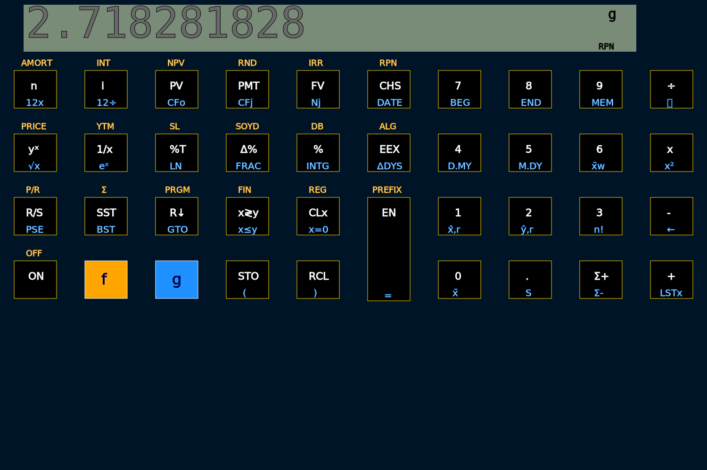

# rpcalc

A web-based rpn calculator.

# Screenshot

# Demo link

Live demo on [github pages.](./rpcalc.html)
	
# Status

Early stage, work in progress.

# Deployment

The calculator runs in a browser. To deploy it, serve up rpcalc.html and rpcalc.cljs as static resources.

## Local Development

For quickly serving up local files, go to the project directory and run:

    python3 -m http.server 9000

This serves up http://localhost:9090/rpcalc.html

# Licence

MIT
